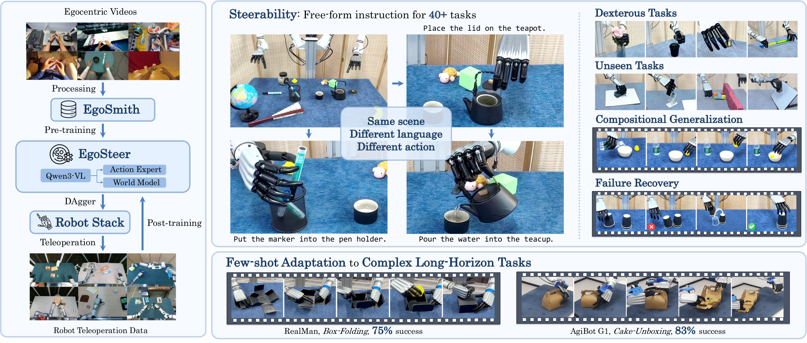
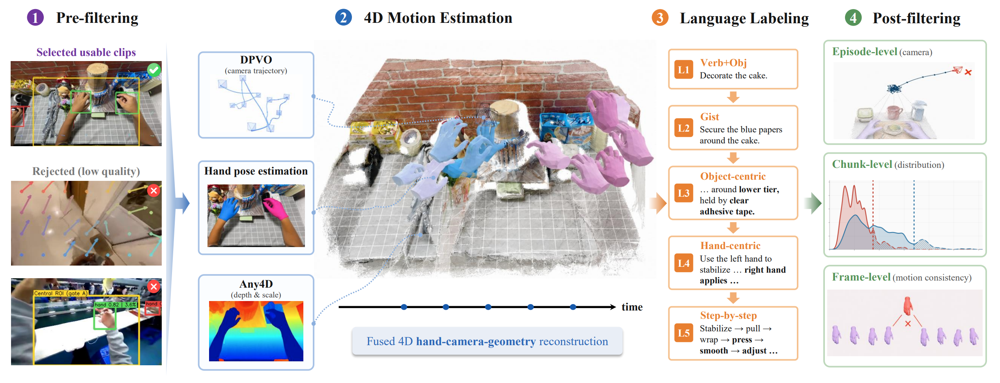

<h1 align="center">EgoSteer: A Full-Stack System Towards Steerable Dexterous Manipulation from Egocentric Videos</h1>

<p align="center">
  <a href="https://arxiv.org/abs/XXXX.XXXXX"></a>
  <a href="https://egosteer.github.io/"></a>
  <a href="https://huggingface.co/datasets/egosteer"></a>
  <a href="https://huggingface.co/egosteer"></a>
</p>

<p align="center">
  <a href="https://github.com/egosteer/egosmith"></a>
  <a href="https://github.com/egosteer/robot-stack"></a>
  <a href="https://github.com/egosteer/egosteer"></a>
</p>

<p align="center">
  
</p>

Our **full-stack system** integrates [EgoSmith](https://github.com/egosteer/egosmith) (this repo), [Robot Stack](https://github.com/egosteer/robot-stack), and [EgoSteer](https://github.com/egosteer/egosteer) to learn from large-scale egocentric human videos and facilitate data-efficient real-robot post-training, enabling steerable dexterous manipulation across over 40 tasks alongside few-shot adaptation to complex, long-horizon tasks.

This repository is **EgoSmith**, an egocentric data pipeline that curates in-the-wild **egocentric videos** into clean, fully-annotated training data for steerable **dexterous manipulation**. It runs **~9× faster than HaWoR** through window batching and overlapped
CPU-decode / GPU-compute.

<p align="center">
  
</p>

## Pipeline

1. **Pre-filtering**: discard locomotion, occlusion, and bystander hands (optical-flow ego-motion
   gate + YOLO hand gate).
2. **Metric 4D motion**: HaWoR regresses camera-frame MANO hands;
   [DPVO](https://github.com/princeton-vl/DPVO) (scale-free camera tracking) +
   [Any4D](https://github.com/Any-4D/Any4D) (per-frame metric depth) recover per-frame camera
   intrinsics/extrinsics and metric scene depth, scale-aligned into temporally consistent
   world-space bimanual hand trajectories and actions.
3. **Language labeling**: a multimodal LLM filters non-manipulation clips and writes five
   coarse-to-fine instruction levels.
4. **Post-filtering**: episode / chunk / frame quality control removes reconstruction artifacts,
   inaccurate metric scale, and head-tracking drift.

## Installation

EgoSmith runs in a single conda env named `egosmith`.

```bash
# 1. Environment (CUDA 12.8 + Torch 2.8 + DPVO source build; idempotent).
export CUDA_HOME=/usr/local/cuda-12.8        # point at your toolkit
bash scripts/setup/setup_env.sh
conda activate egosmith

# 2. HaWoR obtained from the pinned submodule (see docs/hawor_provenance.md).
git submodule update --init thirdparty/hawor_upstream
bash scripts/setup/fetch_hawor_base.sh

# 3. Model weights.
bash scripts/setup/download_weights.sh

# 4. Verify.
bash scripts/setup/validate_setup.sh
```

MANO assets are **not** downloadable by script (research license). Download from the
[MANO site](https://mano.is.tue.mpg.de/) and place them at `_DATA/data/mano/MANO_RIGHT.pkl` and
`_DATA/data_left/mano_left/MANO_LEFT.pkl`.

Optional: make the packages importable from anywhere (otherwise run from the repo root):

```bash
pip install -e .
```

See [docs/install.md](docs/install.md) for the manual step-by-step and troubleshooting.

## Quickstart

**1. Curate a single video into a trainable WebDataset**

```bash
# configs/my_video.yaml:
#   video: /path/to/input.mp4
python scripts/run_dataset_pipeline.py --config configs/my_video.yaml
```

This extracts frames, runs the HaWoR / DPVO / Any4D stages, filters, builds the WebDataset, and
validates the outputs. Language annotation is optional, so empty instruction fields are valid here.
The output is a WebDataset of per-frame samples; its layout and the 116-d `lowdim` fields are
described in [docs/dataset_format.md](docs/dataset_format.md).

**2. See it work on the bundled example**

Reconstruct one video end-to-end and overlay the hands back onto it with `demo.py`. It reads pre-extracted frames, so extract first:

```bash
python scripts/extract_frames.py --video_path example_video/video_0.mp4
python demo.py --video_path example_video/video_0.mp4
```

For other ways to inspect a finished run, see
[Inspect & visualize](docs/dataset_pipeline.md#inspect--visualize).

## Documentation

Start here, then follow the guide for what you want to do:

| I want to… | Read |
|---|---|
| Install & troubleshoot | [docs/install.md](docs/install.md) |
| Understand the pipeline and its stages | [docs/dataset_pipeline.md](docs/dataset_pipeline.md) |
| Know which **data inputs** are supported (single video, folders, BuildAI / HOT3D / FPHA …) | [docs/inputs.md](docs/inputs.md) |
| Generate **language instructions** (configure the API) | [docs/annotation.md](docs/annotation.md) |
| Run over a **whole dataset** / multi-GPU / multi-host | [docs/running_at_scale.md](docs/running_at_scale.md) |
| Know what the **output** looks like (lowdim / meta schema) | [docs/dataset_format.md](docs/dataset_format.md) |
| Configure a run | [configs/README.md](configs/README.md) |
| Navigate the code | [docs/repo_map.md](docs/repo_map.md) |
| HaWoR & licensing details | [docs/hawor_provenance.md](docs/hawor_provenance.md) |

## Repository layout

- `src/`: source code: `lib` (the pipeline: stages, filtering, WebDataset build, viewer), plus the
  obtained HaWoR codebase (`infiller` / `hawor`).
- `scripts/`: entrypoints: `run_dataset_pipeline.py`, `batch_infer.py`, plus `setup/`, `build/`,
  `inspection/`.
- `configs/`: example configs.
- `docs/`: the guides linked above.
- `thirdparty/`: vendored DPVO, plus the `Any4D` and `hawor_upstream` submodules.

## Acknowledgements

EgoSmith builds on excellent open-source work. Thank you to the authors:

- [HaWoR](https://github.com/ThunderVVV/HaWoR): egocentric hand reconstruction (the backbone).
- [Any4D](https://github.com/Any-4D/Any4D): feed-forward metric 4D reconstruction.
- [DPVO](https://github.com/princeton-vl/DPVO): deep patch visual odometry.

## License

EgoSmith's own code is **Apache-2.0** (see [license.txt](license.txt)). Dependencies obtained
separately keep their own licenses (notably HaWoR and MANO are non-commercial / research-only) and
are not redistributed here, see [docs/hawor_provenance.md](docs/hawor_provenance.md). You are
responsible for complying with each dependency's license.
