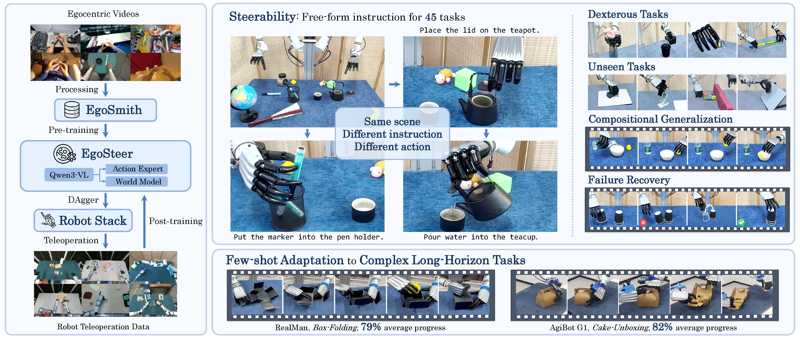
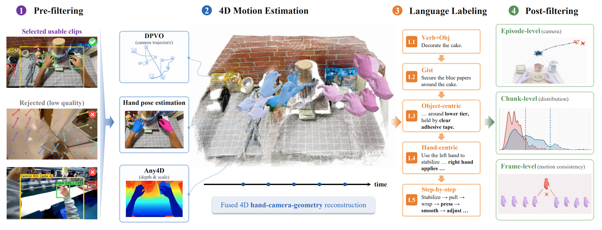

<h1 align="center">EgoSteer: A Full-Stack System Towards Steerable Dexterous Manipulation from Egocentric Videos</h1>

<p align="center">
  <a href="https://arxiv.org/abs/2607.09701"></a>
  <a href="https://egosteer.github.io/"></a>
  <a href="https://huggingface.co/datasets/egosteer"></a>
  <a href="https://huggingface.co/egosteer"></a>
</p>

<p align="center">
  <a href="https://github.com/egosteer/egosmith"></a>
  <a href="https://github.com/egosteer/robot-stack"></a>
  <a href="https://github.com/egosteer/egosteer"></a>
</p>

<p align="center">
  
</p>

Our **full-stack system** integrates [EgoSmith](https://github.com/egosteer/egosmith) (this repo), [Robot Stack](https://github.com/egosteer/robot-stack), and [EgoSteer](https://github.com/egosteer/egosteer) to learn from large-scale egocentric human videos and facilitate data-efficient real-robot post-training, enabling steerable dexterous manipulation across 45 tasks alongside few-shot adaptation to complex, long-horizon tasks.

This repository is **EgoSmith**, an egocentric data pipeline that curates in-the-wild **egocentric videos** into clean, fully-annotated training data for steerable **dexterous manipulation**. It runs **~8.3× faster than HaWoR** through window batching and overlapped
CPU-decode / GPU-compute.

We release EgoSmith annotations in LeRobot v3 format, including hand poses,
camera trajectories, language instructions, and source-frame mappings.
The releases contain no RGB images or depth maps.

<p align="center">
  
</p>

## News

- **2026-09-23**: **📦 Dataset release:** the egocentric human dataset curated with this pipeline for [EgoSteer](https://github.com/egosteer/egosteer) pretraining, with **9.6k hours selected from 100k+ hours of raw videos**, is open-sourced on Hugging Face as [**EgoSteer/EgoSteer-Egocentric**](https://huggingface.co/datasets/EgoSteer/EgoSteer-Egocentric) (LeRobot v3 format; annotations only).
- **2026-09-15**: **📦 Dataset release:** the complementary 192-hour, 193-task real-robot dataset collected with [Robot Stack](https://github.com/egosteer/robot-stack) for [EgoSteer](https://github.com/egosteer/egosteer) post-training is open-sourced on Hugging Face as [**EgoSteer/EgoSteer-RealWorld**](https://huggingface.co/datasets/EgoSteer/EgoSteer-RealWorld) (LeRobot v3 format).

## Pipeline

1. **Pre-filtering**: discard locomotion, occlusion, and bystander hands (optical-flow ego-motion
   gate + YOLO hand gate).
2. **Metric 4D motion**: HaWoR regresses camera-frame MANO hands;
   [DPVO](https://github.com/princeton-vl/DPVO) (scale-free camera tracking) +
   [Any4D](https://github.com/Any-4D/Any4D) (per-frame metric depth) recover per-frame camera
   intrinsics/extrinsics and metric scene depth, scale-aligned into temporally consistent
   world-space bimanual hand trajectories and actions.
3. **Language labeling**: a multimodal LLM filters non-manipulation clips and writes five
   coarse-to-fine instruction levels.
4. **Post-filtering**: episode / chunk / frame quality control removes reconstruction artifacts,
   inaccurate metric scale, and head-tracking drift.

## Installation

EgoSmith runs in a single conda env named `egosmith`.

```bash
# 1. Environment (CUDA 12.8 + Torch 2.8 + DPVO source build; idempotent).
#    Installs cuda-toolkit 12.8 into the env and builds DPVO with CUDA_HOME=$CONDA_PREFIX.
bash scripts/setup/setup_env.sh
conda activate egosmith

# 2. HaWoR obtained from the pinned submodule (see docs/hawor_provenance.md).
git submodule update --init thirdparty/hawor_upstream
bash scripts/setup/fetch_hawor_base.sh

# 3. Model weights.
bash scripts/setup/download_weights.sh

# 4. Verify.
bash scripts/setup/validate_setup.sh
```

MANO assets are **not** downloadable by script (research license). Download from the
[MANO site](https://mano.is.tue.mpg.de/) and place them at `_DATA/data/mano/MANO_RIGHT.pkl` and
`_DATA/data_left/mano_left/MANO_LEFT.pkl`.

Optional: make the packages importable from anywhere (otherwise run from the repo root):

```bash
pip install -e .
```

See [docs/install.md](docs/install.md) for the manual step-by-step and troubleshooting.

## Released Datasets

EgoSmith annotations are released in **LeRobot v3 format**, with one dataset
per source collection. Each release contains:

- 74D states and actions, with robot joint fields `[0:26]` padded.
- Hand-presence flags and per-frame head-camera poses.
- Task text and episode-level candidate instructions.
- Source-media identifiers and frame indices for recovering RGB frames.

The releases contain **no RGB images or depth maps**. Obtain the original
media from the source dataset under its terms. Where source mappings are
available, use `source_media` and `source_frame_index` to locate the images,
and resize them to `calibration/head_image_size`.

Labels are sampled at 30 fps. `source_frame_observed` distinguishes directly
observed labels from labels interpolated between observed frames.

Each release records its hand-pose coordinate frame as `hand_frame` in
`meta/egosmith_provenance.json`. With `camera`, hand poses are expressed in the
current frame's head-camera coordinates; with `world`, they are in the episode's
SLAM world frame and the per-frame world-to-camera matrix maps them into the
current frame's head camera. Actions describe the next-frame hand pose in the
same frame as the state. The converter in this repository defaults to `world`.

### Loading annotations

```python
from lerobot.datasets.lerobot_dataset import LeRobotDataset

dataset = LeRobotDataset(
    repo_id="local/egosmith_labels",
    root="/path/to/dataset",
)
sample = dataset[0]

sample["observation.state"]   # [74]
sample["action"]              # [74]
sample["task"]                # Dataset name; instructions are in the episode metadata
sample["source_frame_index"]  # Frame index in the original media
```

See each dataset's README, `meta/release.json`, and `LICENSES/` for its
source-media access instructions and license terms.

## Quickstart

**1. Curate a single video into a trainable WebDataset**

```bash
# configs/my_video.yaml:
#   video: /path/to/input.mp4
export HAWOR_BATCH_TMPDIR=/large/disk/tmp   # required: stage-3 scratch root (or HAWOR_STAGE3_TMP_ROOT)
python scripts/run_dataset_pipeline.py --config configs/my_video.yaml
```

The SLAM stage materializes many GB of frames into a scratch root that is never defaulted; set
`HAWOR_STAGE3_TMP_ROOT` or `HAWOR_BATCH_TMPDIR` (or `infer.slam.stage3_tmp_root` in the config),
otherwise the preflight aborts the run before frame extraction. The preflight runs after the
optional `clip` step of `prepare`, so a configured `clip.mode` (including paid API clipping) runs
before these checks.

This extracts frames, runs the HaWoR / DPVO / Any4D stages, filters, builds the WebDataset, and
validates the outputs. Language annotation is optional, so empty instruction fields are valid here.
The output is a WebDataset of per-frame samples; its layout and the 116-d `lowdim` fields are
described in [docs/dataset_format.md](docs/dataset_format.md).

This command produces WebDataset shards. For the published LeRobot
annotations, see [Released Datasets](#released-datasets).

**2. See it work on the bundled example**

Reconstruct one video end-to-end and overlay the hands back onto it with `demo.py`. It reads pre-extracted frames, so extract first:

```bash
python scripts/extract_frames.py --video_path example_video/video_0.mp4
python demo.py --video_path example_video/video_0.mp4
```

For other ways to inspect a finished run, see
[Inspect & visualize](docs/dataset_pipeline.md#inspect--visualize).

## Documentation

Start here, then follow the guide for what you want to do:

| I want to… | Read |
|---|---|
| Install & troubleshoot | [docs/install.md](docs/install.md) |
| Understand the pipeline and its stages | [docs/dataset_pipeline.md](docs/dataset_pipeline.md) |
| Know which **data inputs** are supported (single video, folders, BuildAI / HOT3D / FPHA …) | [docs/inputs.md](docs/inputs.md) |
| Generate **language instructions** (configure the API) | [docs/annotation.md](docs/annotation.md) |
| Run over a **whole dataset** / multi-GPU / multi-host | [docs/running_at_scale.md](docs/running_at_scale.md) |
| Know what the **output** looks like (lowdim / meta schema) | [docs/dataset_format.md](docs/dataset_format.md) |
| Configure a run | [configs/README.md](configs/README.md) |
| Navigate the code | [docs/repo_map.md](docs/repo_map.md) |
| HaWoR & licensing details | [docs/hawor_provenance.md](docs/hawor_provenance.md) |

## Repository layout

- `src/`: source code: `lib` (the pipeline: stages, filtering, WebDataset build, LeRobot export), plus the
  obtained HaWoR codebase (`infiller` / `hawor`).
- `scripts/`: entrypoints: `run_dataset_pipeline.py`, `batch_infer.py`, plus `setup/`, `build/`.
- `configs/`: example configs.
- `docs/`: the guides linked above.
- `thirdparty/`: vendored DPVO and Any4D, plus the `hawor_upstream` and `chumpy_upstream` submodules.

## Acknowledgements

EgoSmith builds on excellent open-source work. Thank you to the authors:

- [HaWoR](https://github.com/ThunderVVV/HaWoR): egocentric hand reconstruction (the backbone).
- [Any4D](https://github.com/Any-4D/Any4D): feed-forward metric 4D reconstruction.
- [DPVO](https://github.com/princeton-vl/DPVO): deep patch visual odometry.

## License

EgoSmith's own code is **Apache-2.0** (see [license.txt](license.txt)). Dependencies obtained
separately keep their own licenses (notably HaWoR and MANO are non-commercial / research-only) and
are not redistributed here, see [docs/hawor_provenance.md](docs/hawor_provenance.md). You are
responsible for complying with each dependency's license.

## Citation

If you find our paper or this repository helpful in your research or project, please consider citing our work using the following BibTeX citation:

```tex
@misc{zhong2026egosteerfullstacksteerabledexterous,
      title={EgoSteer: A Full-Stack System Towards Steerable Dexterous Manipulation from Egocentric Videos}, 
      author={Yifan Zhong and Zhang Chen and Tianrui Guan and Fanlian Zeng and Yuyao Ye and Tianjia He and Ka Nam Lui and Jiayi Li and Tingrui Zhang and Ruilin Yan and Xinhao Ji and Guangyu Zhao and Wenjie Lou and Jiayuan Zhang and Yuanpei Chen and Yaodong Yang},
      year={2026},
      eprint={2607.09701},
      archivePrefix={arXiv},
      primaryClass={cs.RO},
      url={https://arxiv.org/abs/2607.09701}, 
}
```
